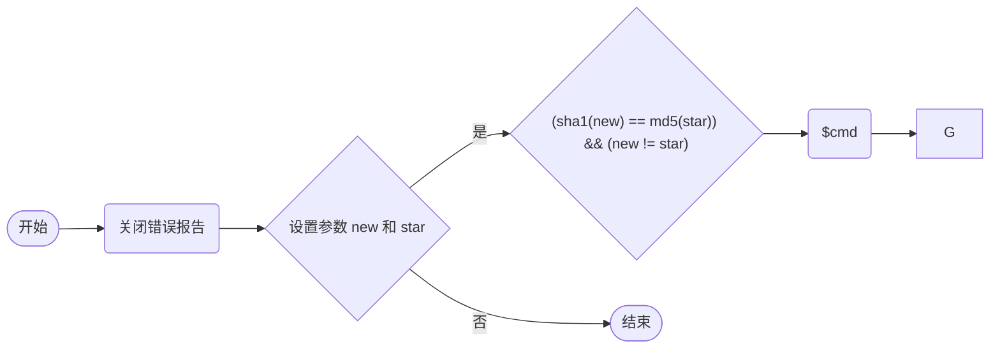

## 遗失的拉链

**提示：Pangbai 的拉链找不到了 你可以帮他找到他的拉链吗**

根据提示拉链应该与 `zip` 有关，这里说拉链找不到了，可以使用 dirsearch 进行目录扫描查找与 `zip` 相关的内容

```shell
python dirsearch.py -u 127.0.0.1:3307
```

扫描结果：

```shell

  _|. _ _  _  _  _ _|_    v0.4.3
 (_||| _) (/_(_|| (_| )

Extensions: php, aspx, jsp, html, js | HTTP method: GET | Threads: 25 | Wordlist size: 11460

Output File: C:\Users\puppy\Desktop\dirsearch-0.4.3\reports\_127.0.0.1_3307\_25-04-24_09-08-17.txt

Target: http://127.0.0.1:3307/

[09:08:18] Starting:
[09:08:24] 403 -  276B  - /.ht_wsr.txt
[09:08:24] 403 -  276B  - /.htaccess.save
[09:08:24] 403 -  276B  - /.htaccess.sample
[09:08:24] 403 -  276B  - /.htaccess.orig
[09:08:24] 403 -  276B  - /.htaccess.bak1
[09:08:24] 403 -  276B  - /.htaccess_extra
[09:08:24] 403 -  276B  - /.htaccessBAK
[09:08:24] 403 -  276B  - /.htaccess_orig
[09:08:24] 403 -  276B  - /.htaccess_sc
[09:08:24] 403 -  276B  - /.htaccessOLD2
[09:08:24] 403 -  276B  - /.htaccessOLD
[09:08:24] 403 -  276B  - /.html
[09:08:24] 403 -  276B  - /.htm
[09:08:24] 403 -  276B  - /.htpasswd_test
[09:08:24] 403 -  276B  - /.httr-oauth
[09:08:24] 403 -  276B  - /.htpasswds
[09:08:58] 200 -  861B  - /index.html
[09:09:17] 200 -    3KB - /server-status/
[09:09:17] 200 -    3KB - /server-status
[09:09:32] 200 -    1KB - /www.zip

Task Completed
```

访问 `127.0.0.1:3307/www.zip`，下载解压后得到 `pizwww.php`

```php
<?php
error_reporting(0);
//for fun
if(isset($_GET['new'])&&isset($_POST['star'])){
    if(sha1($_GET['new'])===md5($_POST['star'])&&$_GET['new']!==$_POST['star']){
        //欸 为啥sha1和md5相等呢
        $cmd = $_POST['cmd'];
        if (preg_match("/cat|flag/i", $cmd)) {
            die("u can not do this ");
        }
        echo eval($cmd);
    }else{
        echo "Wrong";

    } 
}
```

代码审计：
- `error_reporting(0);`：关闭错误报告
- 判断是否通过 GET 方法和 POST 方法分别传入参数 `new` 和 `star`
  - TRUE，继续判断 `new` 的 sha1 哈希值和 `star` 的 md5 哈希值是否相等并且 `new` 和 `star` 的内容不同
    - FALSE，输出 `Wrong`
    - TRUE，将 POST 方法传入的参数 `cmd` 值赋给变量 `$cmd`